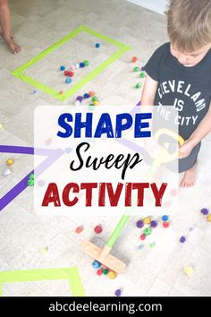

# Obstacle Game 
-✅ Obstacles falling from the top of the screen.

-✅ Collision detection to determine when the player loses.

-✅ A scoring system to track how long the player survives.

-Use arrow keys (⬅️ ➡️) to move left and right.

-Avoid obstacles! If you get hit, the game ends with an alert message.

-Your score increases the longer you survive.

